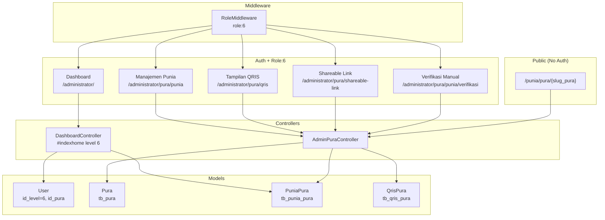
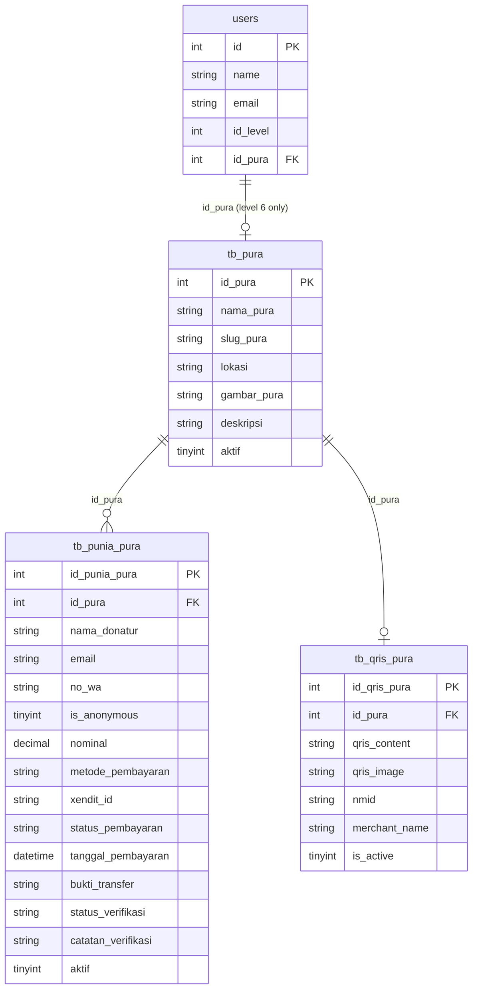

# Design Document: Admin Pura (Level 6)

## Overview

Fitur Admin Pura memperkenalkan role baru `id_level = 6` pada sistem yang sudah ada. Role ini bertanggung jawab mengelola punia online untuk satu Pura tertentu, dengan tampilan mobile ringan yang mengikuti pola Kelian Adat (level 2).

Desain ini bersifat additive — menambahkan tabel, model, controller, dan views baru tanpa mengubah alur yang sudah berjalan untuk role lain, kecuali:
1. Menambahkan case `level == "6"` di `DashboardController::indexhome()`
2. Menambahkan kondisi `level == "6"` di `mobile_layout.blade.php` untuk bottom navigation
3. Membersihkan tampilan form Admin Sistem (level 4) dari field pura/banjar

Infrastruktur database (`tb_pura`, `tb_punia_pura`, `tb_qris_pura`, kolom `id_pura` di `users`) sudah ada berdasarkan model yang ditemukan di codebase. Migrasi hanya diperlukan jika tabel/kolom belum ada di database production.

---

## Architecture



---

## Components and Interfaces

### 1. Database Migrations

Tiga tabel sudah direpresentasikan oleh model yang ada. Migrasi perlu memastikan struktur berikut:

**`tb_pura`** (sudah ada, cek kolom `slug_pura`):
- Tambah kolom `slug_pura VARCHAR(100) UNIQUE NULL` jika belum ada — digunakan untuk shareable link

**`tb_punia_pura`** (sudah ada):
- Struktur sudah lengkap di model `PuniaPura`

**`tb_qris_pura`** (sudah ada):
- Struktur sudah lengkap di model `QrisPura`

**`users`** (sudah ada kolom `id_pura`):
- Kolom `id_pura` sudah ada di `$fillable` model `User`

### 2. Models

**`Pura`** — tambahkan method `getShareableLinkAttribute()`:
```php
public function getShareableLinkAttribute(): string
{
    $identifier = $this->slug_pura ?? $this->id_pura;
    return url("/punia/pura/{$identifier}");
}
```

**`PuniaPura`** — sudah lengkap, tidak ada perubahan.

**`QrisPura`** — sudah lengkap, tidak ada perubahan.

**`User`** — relasi `pura()` sudah ada. Tidak ada perubahan model.

### 3. RoleMiddleware

File: `app/Http/Middleware/RoleMiddleware.php`

Tidak perlu perubahan kode — middleware sudah menggunakan `in_array()` dengan variadic `$levels`, sehingga `role:6` langsung berfungsi. Yang perlu dilakukan adalah menambahkan `role:6` ke route group yang sesuai.

Tambahkan label role di `mobile_layout.blade.php`:
```php
$roleLabel = match(Session::get('level')) {
    '2' => 'Kelian',
    '3' => 'Usaha',
    '5' => 'Counter',
    '6' => 'Admin Pura',  // tambahkan ini
    '7' => 'Penagih',
    default => 'Admin',
};
```

### 4. AdminPuraController

File: `app/Http/Controllers/Administrator/AdminPuraController.php`

Interface publik controller:

```php
class AdminPuraController extends BaseController
{
    // Dashboard — dipanggil dari DashboardController::indexhome() level 6
    public function dashboard(Request $request): View

    // Daftar transaksi punia dengan filter tanggal
    public function puniaIndex(Request $request): View

    // Antrian verifikasi manual
    public function puniaVerifikasi(Request $request): View

    // Approve verifikasi manual
    public function puniaApprove(Request $request): RedirectResponse

    // Reject verifikasi manual
    public function puniaReject(Request $request): RedirectResponse

    // Tampilan QRIS
    public function qris(Request $request): View

    // Download gambar QRIS
    public function qrisDownload(Request $request): Response

    // Halaman shareable link
    public function shareableLink(Request $request): View

    // Halaman publik punia pura (tanpa auth)
    public function publicPunia(string $identifier): View
}
```

**Pola keamanan** — setiap method yang mengakses data spesifik pura menggunakan helper private:

```php
private function getAuthPuraId(): int
{
    return Auth::user()->id_pura;
}

private function authorizeForPura(int $requestedPuraId): void
{
    if ($requestedPuraId !== $this->getAuthPuraId()) {
        abort(403, 'Akses ditolak: Pura tidak sesuai.');
    }
}
```

### 5. Routes

Ditambahkan di `routes/web.php` dalam grup `administrator`:

```php
// Admin Pura (Level 6)
Route::group(['middleware' => 'role:6'], function () {
    Route::get('/pura/punia', 'Administrator\AdminPuraController@puniaIndex');
    Route::get('/pura/punia/verifikasi', 'Administrator\AdminPuraController@puniaVerifikasi');
    Route::post('/pura/punia/approve', 'Administrator\AdminPuraController@puniaApprove');
    Route::post('/pura/punia/reject', 'Administrator\AdminPuraController@puniaReject');
    Route::get('/pura/qris', 'Administrator\AdminPuraController@qris');
    Route::get('/pura/qris/download', 'Administrator\AdminPuraController@qrisDownload');
    Route::get('/pura/shareable-link', 'Administrator\AdminPuraController@shareableLink');
});
```

Route publik (di luar grup `administrator`):
```php
// Shareable Link Publik
Route::get('/punia/pura/{identifier}', 'Administrator\AdminPuraController@publicPunia')
    ->name('public.punia.pura');
```

### 6. DashboardController — Perubahan

Tambahkan case level 6 di `indexhome()`:

```php
} else if ($level == "6") {
    $pura = Auth::user()->pura;

    if (!$pura) {
        return view('backend.adminpura.home', [
            'pura' => null,
            'total_punia' => 0,
            'transaksi_hari_ini' => 0,
        ]);
    }

    $total_punia = PuniaPura::where('id_pura', $pura->id_pura)
        ->where('status_pembayaran', 'completed')
        ->where('aktif', '1')
        ->sum('nominal');

    $transaksi_hari_ini = PuniaPura::where('id_pura', $pura->id_pura)
        ->whereDate('created_at', today())
        ->where('aktif', '1')
        ->count();

    return view('backend.adminpura.home', compact('pura', 'total_punia', 'transaksi_hari_ini'));
}
```

### 7. Views

Semua view Admin Pura menggunakan `@extends('mobile_layout')` mengikuti pola kelian.

| File | Deskripsi |
|------|-----------|
| `resources/views/backend/adminpura/home.blade.php` | Dashboard mobile Admin Pura |
| `resources/views/backend/adminpura/punia.blade.php` | Daftar transaksi punia dengan filter tanggal |
| `resources/views/backend/adminpura/punia_verifikasi.blade.php` | Antrian verifikasi pembayaran manual |
| `resources/views/backend/adminpura/qris.blade.php` | Tampilan QRIS + tombol download |
| `resources/views/backend/adminpura/shareable_link.blade.php` | Halaman shareable link + tombol copy |
| `resources/views/public/punia_pura.blade.php` | Halaman publik punia pura (tanpa auth) |

**Bottom navigation untuk level 6** ditambahkan di `mobile_layout.blade.php`:
```blade
@if(Session::get('level') == "6")
    <a href="{{ url('administrator/') }}" ...>Home</a>
    <a href="{{ url('administrator/pura/punia') }}" ...>Punia</a>
    <a href="{{ url('administrator/pura/qris') }}" ...>QRIS</a>
    <a href="{{ url('administrator/pura/shareable-link') }}" ...>Link</a>
@endif
```

### 8. Pembersihan Form Admin Sistem (Level 4)

Di view form pembuatan/pembaruan user Admin Sistem, field pura dan banjar dihapus atau disembunyikan dengan kondisi:
```blade
@if(Auth::user()->id_level != 4)
    {{-- field pura dan banjar --}}
@endif
```

---

## Data Models

### Skema Relasi



### Nilai Status

**`tb_punia_pura.status_pembayaran`**: `pending` | `completed` | `failed` | `expired`

**`tb_punia_pura.status_verifikasi`**: `pending` | `approved` | `rejected` | `null`

**`tb_punia_pura.metode_pembayaran`**: `xendit` | `qris` | `manual`

**`tb_qris_pura.is_active`**: `0` | `1`

**`tb_pura.aktif`**: `0` | `1`

---

## Correctness Properties

*A property is a characteristic or behavior that should hold true across all valid executions of a system — essentially, a formal statement about what the system should do. Properties serve as the bridge between human-readable specifications and machine-verifiable correctness guarantees.*

### Property 1: Isolasi Data Punia

*For any* Admin Pura dengan `id_pura = X`, semua transaksi PuniaPura yang dikembalikan oleh controller harus memiliki `id_pura = X`. Tidak ada transaksi dari pura lain yang boleh muncul.

**Validates: Requirements 4.1, 4.8, 7.3, 7.5**

---

### Property 2: Akses Lintas Pura Menghasilkan 403

*For any* Admin Pura dengan `id_pura = X` yang mencoba mengakses atau memodifikasi resource (PuniaPura atau QrisPura) dengan `id_pura = Y` di mana `Y ≠ X`, sistem harus mengembalikan HTTP 403.

**Validates: Requirements 4.8, 5.5, 7.3, 7.4**

---

### Property 3: Akses Route Admin Pura Hanya untuk Level 6

*For any* pengguna dengan `id_level ≠ 6` yang mencoba mengakses route dalam grup `role:6`, sistem harus menolak akses dan mengarahkan ke halaman login.

**Validates: Requirements 1.5, 7.1**

---

### Property 4: Total Punia Dashboard Konsisten dengan Data

*For any* Pura dengan sekumpulan transaksi PuniaPura, total nominal yang ditampilkan di dashboard harus sama persis dengan `SUM(nominal)` dari transaksi yang memiliki `status_pembayaran = 'completed'` dan `aktif = '1'` untuk pura tersebut.

**Validates: Requirements 3.3, 4.4**

---

### Property 5: Filter Tanggal Mengembalikan Transaksi dalam Rentang

*For any* rentang tanggal `[awal, akhir]` yang diberikan sebagai filter, semua transaksi PuniaPura yang dikembalikan harus memiliki `tanggal_pembayaran` atau `created_at` yang berada dalam rentang tersebut (inklusif).

**Validates: Requirements 4.3**

---

### Property 6: Antrian Verifikasi Hanya Berisi Transaksi Manual Pending

*For any* set transaksi PuniaPura untuk suatu pura, antrian verifikasi yang ditampilkan harus berisi tepat transaksi-transaksi yang memiliki `metode_pembayaran = 'manual'` DAN `status_verifikasi = 'pending'`. Tidak lebih, tidak kurang.

**Validates: Requirements 4.5**

---

### Property 7: State Transition Verifikasi Konsisten

*For any* transaksi PuniaPura dengan `status_verifikasi = 'pending'`:
- Setelah approve: `status_verifikasi = 'approved'` DAN `status_pembayaran = 'completed'`
- Setelah reject dengan catatan `N`: `status_verifikasi = 'rejected'` DAN `catatan_verifikasi = N`

**Validates: Requirements 4.6, 4.7**

---

### Property 8: Shareable Link Aktif/Non-Aktif

*For any* Pura dengan `aktif = '1'`, shareable link-nya harus mengembalikan halaman publik dengan informasi pura dan form punia. *For any* Pura dengan `aktif = '0'`, shareable link-nya harus mengembalikan halaman informasi "tidak tersedia".

**Validates: Requirements 6.5, 6.6**

---

### Property 9: Dashboard Menampilkan Nama Pura yang Ditugaskan

*For any* Admin Pura yang ditugaskan ke Pura dengan nama `N`, halaman dashboard harus menampilkan string `N` sebagai nama pura.

**Validates: Requirements 3.2**

---

## Error Handling

| Kondisi | Penanganan |
|---------|-----------|
| Admin Pura tanpa `id_pura` | Dashboard menampilkan pesan "Belum ada Pura yang ditugaskan" tanpa crash |
| Akses resource pura lain | `abort(403)` — halaman 403 standar Laravel |
| Pura tidak aktif di shareable link | View `public/punia_pura.blade.php` dengan flag `$pura_inactive = true` |
| QrisPura tidak ditemukan | View QRIS menampilkan pesan "QRIS belum tersedia" |
| Verifikasi transaksi yang sudah diproses | Redirect back dengan pesan error "Transaksi sudah diproses sebelumnya" |
| User level 4 dengan `id_pura` tersimpan | `id_pura` diabaikan di semua query DashboardController untuk level 4 |

---

## Testing Strategy

### Unit Tests (PHPUnit)

Fokus pada logika bisnis yang spesifik:

- `AdminPuraControllerTest::test_dashboard_shows_correct_pura_name()` — verifikasi nama pura di view
- `AdminPuraControllerTest::test_dashboard_without_pura_shows_info_message()` — edge case tanpa pura
- `AdminPuraControllerTest::test_qris_page_without_active_qris_shows_message()` — edge case QRIS kosong
- `AdminPuraControllerTest::test_shareable_link_page_shows_correct_url()` — verifikasi URL yang ditampilkan
- `DashboardControllerTest::test_level4_ignores_id_pura()` — verifikasi level 4 tidak difilter by pura

### Property-Based Tests (PHPUnit + Faker sebagai generator)

Menggunakan Faker untuk generate input acak, dijalankan minimum 100 iterasi per property.

Tag format: `/** @group Feature:admin-pura, Property {N}: {deskripsi} */`

**Property 1 — Isolasi Data Punia:**
Generate N pura acak, masing-masing dengan M transaksi acak. Login sebagai Admin Pura pura ke-i. Verifikasi bahwa `puniaIndex()` hanya mengembalikan transaksi dengan `id_pura = i`.

**Property 2 — Akses Lintas Pura 403:**
Generate dua pura berbeda. Login sebagai Admin Pura pura A. Coba akses endpoint dengan `id_pura` pura B. Verifikasi response 403.

**Property 3 — Route Protection:**
Generate user dengan level acak dari {1,2,3,4,5,7}. Coba akses route `role:6`. Verifikasi redirect ke login.

**Property 4 — Total Punia Konsisten:**
Generate N transaksi dengan berbagai status untuk satu pura. Hitung expected sum secara manual. Bandingkan dengan nilai yang dikembalikan controller.

**Property 5 — Filter Tanggal:**
Generate set transaksi dengan tanggal acak. Generate rentang tanggal acak. Verifikasi semua hasil berada dalam rentang.

**Property 6 — Antrian Verifikasi:**
Generate transaksi dengan berbagai kombinasi `metode_pembayaran` dan `status_verifikasi`. Verifikasi antrian hanya berisi `manual + pending`.

**Property 7 — State Transition:**
Generate transaksi pending acak. Jalankan approve/reject. Verifikasi state akhir sesuai.

**Property 8 — Shareable Link:**
Generate pura aktif dan non-aktif. Akses shareable link masing-masing. Verifikasi response sesuai status aktif.

**Property 9 — Nama Pura di Dashboard:**
Generate Admin Pura dengan pura acak. Akses dashboard. Verifikasi nama pura muncul di response.

### Integration Tests

- Verifikasi route group `role:6` terdaftar dan dapat diakses dengan user level 6
- Verifikasi route publik `/punia/pura/{identifier}` dapat diakses tanpa auth
- Verifikasi bottom navigation level 6 muncul di `mobile_layout`
